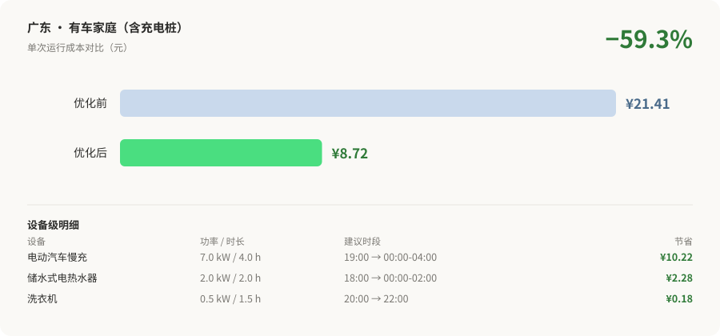

# peak-shift-skill


**中国居民峰谷电价查询与家庭用电优化 · Agent Skill**

[](LICENSE)
[](SKILL.md)
[](data/tariffs/)
[](scripts/)

---

> **输入你家电器，算出挪到谷段能省多少钱。**
> 覆盖全国 31 个省级行政区，纯标准库**零依赖**，可直接被 AI 编程助手调用。

```bash
git clone https://github.com/xfnylqt/peak-shift-skill.git
cd peak-shift-skill
python scripts/entries/optimize_home.py --province 广东 --preset ev_owner
```



---

## 这是什么

一个**可复用的集合型 Agent Skill**：让 AI 编程助手能够回答并解决中国家庭用电错峰问题。

覆盖四类子能力：

| 子能力 | 用户会这样问 | 命令 |
|---|---|---|
| **① 查询** | 「广东的峰谷电价是多少」「哪些省没有峰谷电价」 | `query_tariff.py` |
| **② 测算** | 「热水器挪到谷段能省多少」 | `optimize_home.py` |
| **③ 方案** | 「给我一套全屋错峰方案」 | `optimize_home.py --preset` |
| **④ 可视化** | 「出一份报告」 | `make_report.py` |

**完全自包含**：纯 Python 标准库，无需安装任何依赖，可离线运行。

---

## 安装

### 作为 Agent Skill 使用

```bash
git clone https://github.com/xfnylqt/peak-shift-skill.git

# Claude Code
cp -r peak-shift-skill ~/.claude/skills/peak-shift

# Codex / Cursor / 其他兼容 Agent
cp -r peak-shift-skill ~/.codex/skills/peak-shift
```

之后当对话涉及峰谷电价、电费优化时，Agent 会按 `SKILL.md` 中的工作流自动调用。

### 直接使用脚本

```bash
cd peak-shift-skill

# 查询
python scripts/entries/query_tariff.py --list
python scripts/entries/query_tariff.py --province 广东

# 测算
python scripts/entries/optimize_home.py --province 广东 --loads water_heater
python scripts/entries/optimize_home.py --province 广东 --preset ev_owner

# 出报告
python scripts/entries/make_report.py --province 广东 --preset ev_owner --out output --html
```

---

## 实际效果

**广东 · 有车家庭**（峰谷价差全国第二，0.7773 元/kWh）：

```
电动汽车慢充  7.00 kW  4.0 h  19:00 → 00:00-04:00   ¥16.49 → ¥6.27   省 ¥10.22
储水式热水器  2.00 kW  2.0 h  18:00 → 00:00-02:00   ¥3.18  → ¥0.90   省 ¥2.28
--------------------------------------------------------------------
单次合计 ¥21.41 → ¥8.72    整体降幅 59.3%    预计年省 ¥4,619
```

**新疆**（居民不执行峰谷）：

```
⚠️ 该地区居民生活用电不执行峰谷分时电价：
   官方明确：大工业、一般工商业及其他用电执行分时电价，居民、农业用电不执行。
   例外：居民电采暖用电继续执行 0.22 元/千瓦时。
   因此无法给出错峰建议。
```

---

## 数据覆盖

中国大陆 **31 个省级行政区**：

| 分类 | 数量 |
|---|---|
| 居民执行峰谷分时电价 | **22** |
| 居民**不**执行峰谷分时电价 | **9** |
| 合计 | **31** |

- 价差最高：海南 0.8075、广东 0.7773 元/kWh
- 价差最低：河南、江西 0.1500 元/kWh（**相差 5.4 倍**）
- 每条数据含来源机构、URL、政策文号、生效日期与可信度分级

---

## 与三个源仓库的关系

本 Skill 的 `data/` 与 `scripts/peak_shift/`、`scripts/viz/` 是**构建产物**，由三个源仓库生成：

```
cn-tou-tariff  ·  peak-shift-engine  ·  peak-shift-studio
        （源，单一事实来源）
                    │
                    │  python scripts/build.py
                    ▼
            peak-shift-skill（产物，自包含）
```

**为什么这样设计**：

| 好处 | 说明 |
|---|---|
| 自包含 | Skill 目录拷走即用，离线可用，无版本漂移 |
| 无重复维护 | 数据与代码不手工复制，靠构建脚本同步 |
| 源可独立演进 | 三个仓库仍可独立发版，不影响 skill 的分发形态 |

### 重新构建

数据更新后（如在 `cn-tou-tariff` 中新增省份）：

```bash
python scripts/build.py          # 同步
python scripts/build.py --check  # 仅检查差异
```

构建信息记录在 `BUILD_INFO.json`（含各源仓库的 commit）。

> ⚠️ `data/` 与 `scripts/peak_shift/`、`scripts/viz/` 下的文件**请勿手工修改**，会被下次构建覆盖。

---

## 目录结构

```
peak-shift-skill/
├── SKILL.md                       # ★ Agent 入口：何时用、怎么做、硬性规则
├── references/
│   ├── tariff-mechanism.md        # 电价机制、阶梯叠加、地区差异
│   ├── appliance-library.md       # 家电功率库与调度建议
│   └── data-confidence.md         # 可信度分级与使用限制
├── scripts/
│   ├── build.py                   # 构建：从源仓库同步
│   ├── entries/                   # 三个用户入口
│   └── peak_shift/  viz/          # [构建产物] 引擎与图表
├── data/tariffs/                  # [构建产物] 31 省电价数据
└── BUILD_INFO.json
```

---

## 设计原则

1. **不编造数据** —— 数据缺失就直说，不按比例推算后当作官方值
2. **不跨省套用** —— 不执行峰谷的地区不得用邻省数据顶上
3. **金额均为估算** —— 依赖用户提供的功率与作息，不作为承诺
4. **「没有」也是信息** —— 9 个不执行峰谷的地区同样被完整记录

---

## 许可证

[MIT](LICENSE)

---

> 本项目为独立开源项目，与任何政府机构、电网企业无隶属关系。
> 电价政策可能调整，请以当地供电部门公布的最新信息为准。
